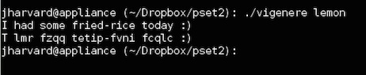

Vigenere
========

vigenere.c is a program I created for CS50 Pset2. This program enciphers users' texts, using a password (the second command line argument). It adopts [Vigenère cipher](http://en.wikipedia.org/wiki/Vigenère_cipher "wiki")'s algorithm. Unlike the caesar cipher, the vigenère cipher takes a string as the key, not an integer. In that sense, vigenère cipher is more secure than the caesar cipher.  

